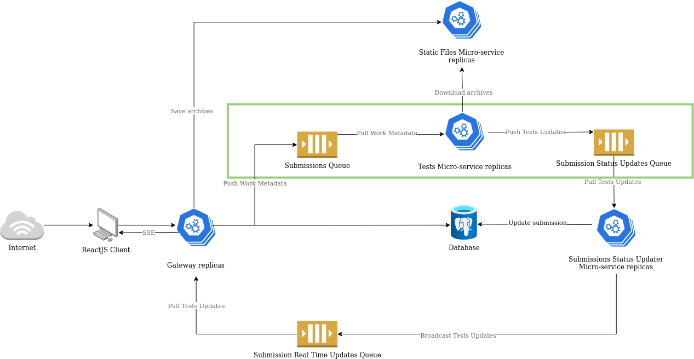

# Tests Micro-service

Welcome to the tests micro-service. This service is responsible for running the teacher's tests against the student's code and pushing the results to the `submissions-status-updates` queue for the `Submissions Status Updater` micro-service to pick them up and update the database accordingly.

Below is a diagram of the overall architecture of the system with the tests micro-service highlighted in green.

## Documentation

Please, refer to the following documents for more information about the tests micro-service:

| Document | Description |
| --- | --- |
| [Contributing](./docs/contributing.md) | Contributing guidelines. |
| [Environment](./docs/environment.md) | A description of the environment variables used by the tests micro-service. |
| [Sequences Diagrams](./docs/diagrams/sequences.md) | A collection of sequence diagrams describing the interactions between the tests micro-service and other components of the system. |
| [Flow Diagrams](./docs/diagrams/flow.md) | A collection of flow diagrams describing the flow of the tests micro-service. |