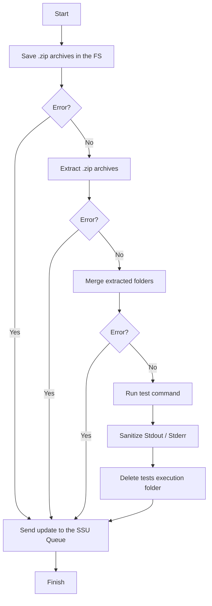

# Sequences diagrams

## Run tests

### Java implementation

#### Explanations

- `Merge extracted folders`: In this step, the `src/test/java` folder from the teacher's code is merged with the `src/main/java` folder from the student's code in the `src/` folder of the language template in order to: 

  - Use the `pom.xml` file from the language template to make sure no additional dependencies are added or removed from the project by the teacher or the student. **This is important because we only guarantee that the tests will run correctly and securely if the dependencies are the same as the ones defined in the language template.**

  - Run the teacher's tests against the student's code.

- `Sanitize Stdout / Stderr`: In this step, the `stdout` and `stderr` of the tests execution are sanitized in order to remove any sensitive information that may be present in the output of the tests execution (e.g. File paths, etc.).