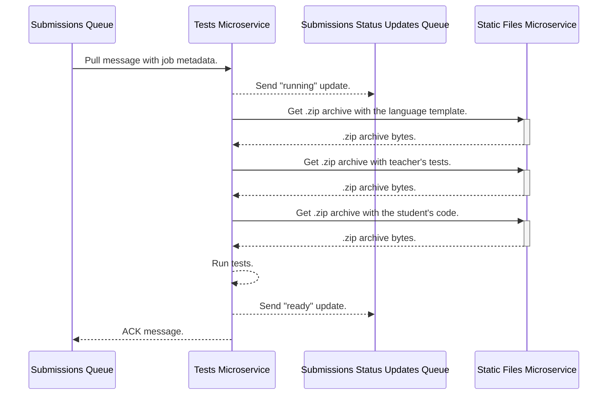

# Sequences diagrams

## Full micro-service flow

```mermaid
sequenceDiagram
    participant SQ as Submissions Queue 
    participant TMSvc as Tests Microservice
    participant SSUQ as Submissions Status Updates Queue
    participant SFMSvc as Static Files Microservice
    
    
    SQ ->> TMSvc: Pull message with job metadata.

    TMSvc -->> SSUQ: Send "running" update.
    
    TMSvc ->>+ SFMSvc: Get .zip archive with the language template.
    SFMSvc-->>- TMSvc: .zip archive bytes.
    TMSvc ->>+ SFMSvc: Get .zip archive with teacher's tests.
    SFMSvc-->>- TMSvc: .zip archive bytes.
    TMSvc ->>+ SFMSvc: Get .zip archive with the student's code.
    SFMSvc-->>- TMSvc: .zip archive bytes.

    TMSvc -->> TMSvc: Run tests.

    TMSvc -->> SSUQ: Send "ready" update.

    TMSvc -->> SQ: ACK message.
    
```

Please, note that the `Run tests` step is further detailed in the [flow diagrams](./flow.md).